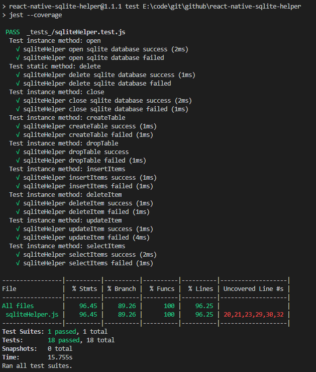
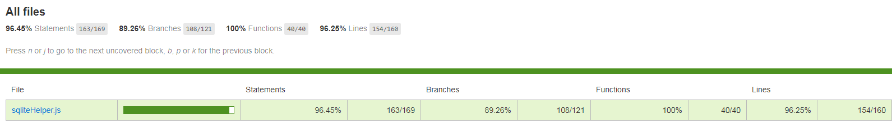
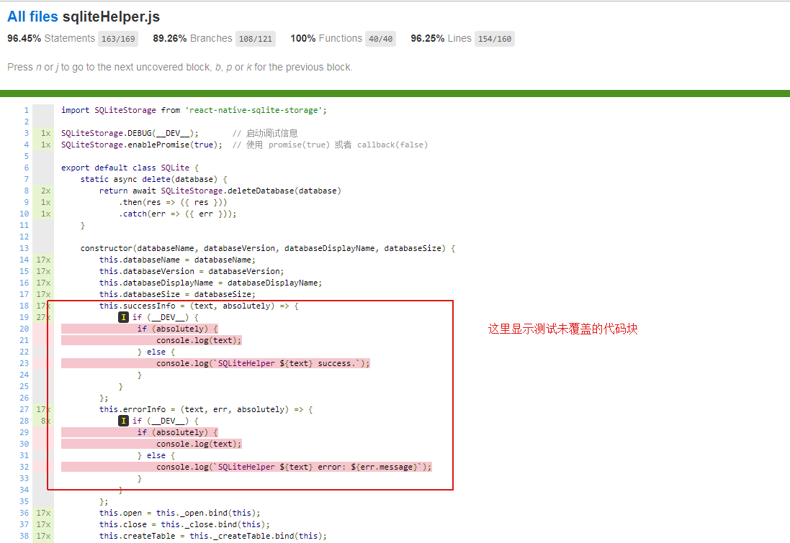
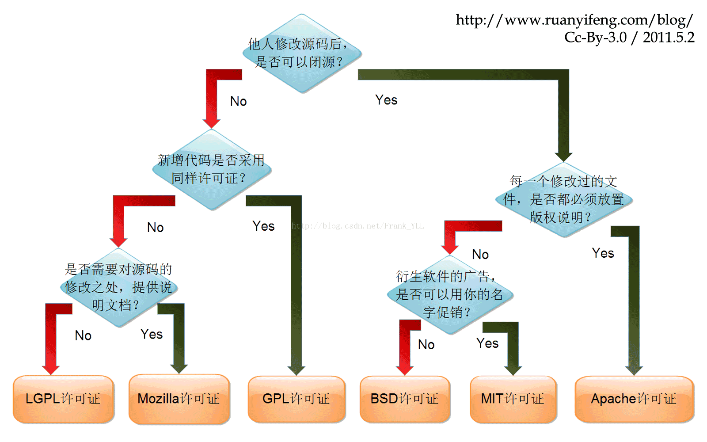

# npm+github

依托 github+npm 开发和维护前端library模块

> 什么是lib模块：node_modules

## 背景介绍

## 名词介绍

### 1. Node

`node:` Node.js® 是一个基于 Chrome V8 引擎 的 JavaScript 运行时。[官网](https://nodejs.org/zh-cn/)

- 怎么理解：

- JavaScript之前只是一种运行在客户端浏览器中的脚本语言，它只能以浏览器webview作为宿主执行，而不能像java一样直接操作于服务端，而nodejs的作用就是可以在服务端执行JavaScript，让它具备像java一样的服务端语言的功能。

- 后端的同事可以理解node的v8引擎它就类似于jvm，是一种可以执行JavaScript的运行环境。

### 2. Npm

`npm:` NPM 是随同 NodeJS 一起安装的一款非常实用的包管理工具。[官方搜索网站](https://www.npmjs.com/)

- 主要作用：

- 用于安装和管理依赖包。 npm install 安装，npm run [script] 执行命令行等等

- 后端的同事可以把 npm 想象成一个简易版的 maven

### 3. Webpack

`webpack:` 本质上，webpack 是一个现代 JavaScript 应用程序的静态模块打包工具。[官网](https://webpack.docschina.org/)

- 主要功能：

- loader: 用于对模块的源代码进行转换，对 html js css 等进行预处理。loader 可以将文件从不同的语言（如 Es6 转换成 Es5；TypeScript 转换为 JavaScript；将 inline-image 转换为 data URL；less 转换成 css...），loader 甚至允许你直接在 JavaScript 模块中 import CSS文件！

- plugin: 插件是 webpack 的支柱功能。插件目的在于解决 loader 无法实现的其他事，例如热更新 Hot Module Replacement(HMR：开发时只需保存代码不用手动刷新直接更新页面)。

- devServer: 能够用于快速开发应用程序，启动本地 localhost 服务，利用 proxy 反向代理解决接口跨域等

- 后端的同事可以把它想象成 tomcat（不完全准确）。

### 4. Eslint

`eslint:` 可配置的 JavaScript 和 JSX 代码检测工具。 [官网](https://cn.eslint.org/docs/user-guide/configuring)

- 主要功能：

- 方便统一 js 代码规范和写法，可配置规则对代码进行报错或警告提示，利用插件自动修复等。

- 后端同事可以理解为类似于java CheckStyle 静态代码检查工具。

### 5. Markdown

`markdown:` Markdown 是一门比 html 更简单的标记语言，其主要用于书写工程项目 readme 文档。 [官网](http://www.markdown.cn/) / [基础语法](https://www.jianshu.com/p/191d1e21f7ed)

### 6. Typescript

`typescript:` 是 JavaScript 类型的超集，本质上是对 js 添加了可选的静态类型和基于类的面向对象编程。

- `d.ts:` 一个纯粹的类型声明文件，不涉及逻辑。

- d.ts 作用：

- 一个好用的 library 插件智能提示是不可或缺的。因为 lib 插件本身就是安装在 node_modules 模块中，我们很少去查看它的源码，因此使用时文档和智能提示就显得非常重要

- d.ts 就经常用于增强 IDE 智能提示。javascript 本身是弱类型，例如参数类型常常不明确，对IDE的提示就不是很友好，而ts 却可以明确定义类型，如果我的代码使用纯js书写，却想让他拥有和 ts 一样的类型智能提示，我们就可以书写声明文件 _*.d.ts_ 。[官方文档](https://www.tslang.cn/docs/handbook/declaration-files/introduction.html) / [*.d.ts代码示例](https://github.com/longlongago2/react-native-sqlite-helper/blob/master/sqliteHelper.d.ts)

### 7. Jest

`jest:` 前端单元测试框架。 [官网](https://jestjs.io/zh-Hans/) / [代码示例](https://github.com/longlongago2/react-native-sqlite-helper/blob/master/_tests_/sqliteHelper.test.js)，其他常用测试框架还有[Mocha](https://mochajs.org/)

- 使用场景：

- 执行测试脚本，执行完毕后提供精准的测试报告，报错代码覆盖率，有效避免人肉测试导致的场景逻辑遗漏。

- 在项目正在进行的情况下，随时进行单元测试，不用等待整体完工或者有具体可操作的界面的时候再测试。

### 8. Git

`git:` Git 是一个开源的分布式版本控制系统，可以有效、高速地处理从很小到非常大的项目版本管理

### 9. Github

`github:` 就是本网站。

- 简单介绍：

- GayHub 是全球最大的同性交友平台。~，其实 GitHub 是一个面向开源及私有软件项目的托管平台，因为只支持 git 作为唯一的版本库格式进行托管，故名 GitHub。

- 不过，为什么说它是交友网站呢？你打开 Github 上一个用户的主页，他的头像 (avatar)、喜欢的人 (following) 、喜欢他的人 (followers)、个人能力 (repositories)、活跃度 (contributions) ，一清二楚...

_注：这是旧版，被微软收购后新版已改版_

### 10. Gitlab

`gitlab:` 不用介绍了，它是仅次于 GitHub 的同性交友平台。

## 开发流程

流程图

## 其他好玩的事儿

### 1. 徽章

如果你有逛GitHub的习惯，应该就已经发现，许多知名的开源项目的README上都有着花花绿绿的各式徽章。比如说这个：

那么这些徽章都是干啥的呢？ [玩转github徽章](https://www.jianshu.com/p/afba6e33e48e) / [自己定制徽章](https://shields.io/)

单纯的链接

使用证书

npm 版本

聊天室 Gitter

Travis 使用.travis.yml 配置文件，告诉 Travis CI 怎样对你的项目进行编译或测试，成功徽章会自动展示passing

Codacy 编程代码自动审查服务平台，可以帮我们分析存在的问题 或者说是 bug,主要包括代码质量、语法规范、功能可用性方面的检查。

订阅数

... 还有很多，喜欢的自己探索自己探索

### 2. 开源许可证

常用的几种证书

