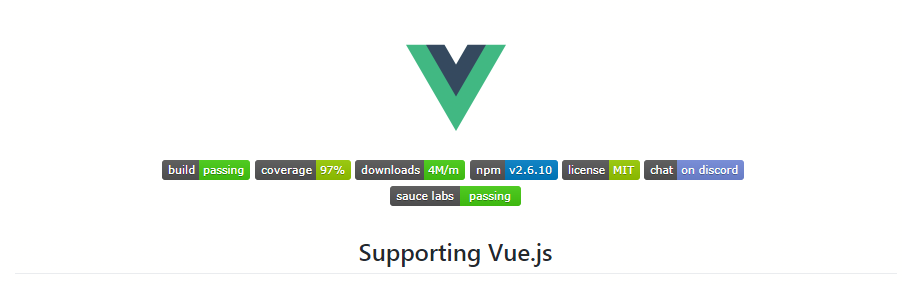

# npm+github

依托 github+npm 开发和维护前端 lib 模块

## 背景介绍

> 前端模块化开发大潮：以前的开发模式，代码冗长混杂，组件复用困难，即使提取出可复用插件，往往都是要通过 script 引入 js 包，往往插件或方法又都暴露在全局，引入太多，往往会带来大概两个问题：<br><br>
> 1、没有命名空间，会污染全局变量，<br>
> 2、如果我的插件又依赖别人的插件，别人的插件又依赖别人的插件，如此循环，又会面临处理复杂的依赖逻辑关系。<br>
> 从利用 CommonJs，requireJs 将前端模块化（解决第一个痛点），再到 npm，webpack 等自动处理复杂的依赖关系（解决第二个痛点），全面的模块化开发打包全流程管理，从青涩一步步走向成熟，这个过程也衍生出了很多规范！<br><br>
> 衍生规范：<a href="#1">CommonJs(node.js)</a> --> <a href="#2">AMD(require.js)</a> --> <a href="#3">CMD(seaJS)</a> --> <a href="#4">UMD(兼容 CommonJs, AMD, var)</a><br><br>
> 一系列的规范产生和发展，最终形成了今天的格局。随着模块化的深度使用，也让我们探索到底什么样的情况适合作为一个 lib 输出。<br><br>
> 这里列举几种我个人的想法：<br>
> 1、与主业务逻辑无关，但又包含很多操作逻辑的富应用，如富文本编辑器之类的<br>
> 2、可以提取出来的公共 UI 组件库，例如 element，iview，ant-design 等等，这些通用组件都是可以通过传入属性或参数去实例化符合要求的不同形态<br>
> 3、utils 纯工具库，例如 moment，lodash<br>
> 。。。

注：

<a name="1">
CommonJs规范： 它是服务端模块化加载规范，由Node推广使用，只能依赖node环境执行。纳尼？？？这么好的东西，是不是就对传统前端开发来说没用了呢？其实，webpack就是使用这个规范去打包依赖，因为 webpack 本身就是依赖 node 环境开发出来的服务端预处理工具。标志性语法：require('module-name') / module.exports，这个 require 和 AMD 的 require 不同，下面会讲到！
</a><br><br>

<a name="2">
requireJs(AMD 规范)：如果说 CommonJs 的出现解决了服务端模块化的问题，那么 require.js(AMD 规范)的出现就是主要解决客户端模块化的问题。（？？？解释上面留的疑问）那么它与 CommonJs 的 require 具体又有什么关系呢？应该说他们什么关系都没有，唯一可能的关系就是传统前端工程师看见 node 工程师可以使用 commonjs 模块化加载眼红，大家都用 js，为什么你行，我不行，所以就发明出来一种适合客户端模块化加载的规范，CommonJs 依赖的是 node 环境的加载，而 requireJs 就是纯客户端浏览器加载的一种规范，它可以直接在浏览器执行，而 commonjs 就不行（但是可以用于 webpack 预处理工具打包构建之后，就可以在浏览器运行啦）。
</a><br><br>

<a name="3">
seaJs(CMD 规范)：结合了 CommonJs 的理念和 AMD 的原理的客户端模块化加载规范，CMD 特别就在于，体现了 CommonJs 按需加载的理念，摒弃了 AMD 的依赖前置，这是一种过渡态，用的不多，具体怎么体现的语法可以自己了解。
</a><br><br>

<a name="4">
UMD 规范：首先 UMD 是什么，中文解释就是通用模块定义，兼容 AMD，CommonJS 和全局变量，一统天下。使用 UMD 规范之后，各种规范自动向下兼容。简单来说，良心的 lib 都应该用 umd 规范发布，这样，node 环境；模块化环境（webapck 等预处理工具、requireJs 等）；传统 CDN 环境（全局变量），就都可以使用啦。那么这么好的东西又该怎么玩呢？webpack 针对 lib 模式（webpack 打包有两种模式，runtime 模式和 library 模式：我们平常使用的生产环境的打包，就是 runtime 模式，打包出来是一个自执行函数，但是 webpack 还可以针对模块化进行打包，即 lib 模式，打包会根据配置规则将对象暴露出来） 打包时提供了这个选择，以下是原文：

```
output.libraryTarget
Which format to export the library:
"var" - Export by setting a variable: var Library = xxx (default)
"this" - Export by setting a property of this: this["Library"] = xxx
"commonjs" - Export by setting a property of exports: exports["Library"] = xxx
"commonjs2" - Export by setting module.exports: module.exports = xxx
"amd" - Export to AMD (optionally named)
"umd" - Export to AMD, CommonJS2 or as property in root
```

</a><br><br>

## 名词介绍

### 1. Node

`node:` Node.js® 是一个基于 Chrome V8 引擎 的 JavaScript 运行时。[官网](https://nodejs.org/zh-cn/)

- 怎么理解：

- JavaScript 之前只是一种运行在客户端浏览器中的脚本语言，它只能以浏览器 webview 作为宿主执行，而不能像 java 一样直接操作于服务端，而 nodejs 的作用就是可以在服务端执行 JavaScript，让它具备像 java 一样的服务端语言的功能。

- 后端的同事可以理解 node 的 v8 引擎它就类似于 jvm，是一种可以执行 JavaScript 的运行环境。

### 2. Npm

`npm:` NPM 是随同 NodeJS 一起安装的一款非常实用的包管理工具。[官方搜索网站](https://www.npmjs.com/)

- 主要作用：

- 用于安装和管理依赖包。 npm install 安装，npm run [script] 执行命令行等等

- 后端的同事可以把 npm 想象成一个简易版的 maven

### 3. Webpack

`webpack:` 本质上，webpack 是一个现代 JavaScript 应用程序的静态模块打包工具。[官网](https://webpack.docschina.org/)

- 主要功能：

- loader: 用于对模块的源代码进行转换，对 html js css 等进行预处理。loader 可以将文件从不同的语言（如 Es6 转换成 Es5；TypeScript 转换为 JavaScript；将 inline-image 转换为 data URL；less 转换成 css...），loader 甚至允许你直接在 JavaScript 模块中 import CSS 文件！

- plugin: 插件是 webpack 的支柱功能。插件目的在于解决 loader 无法实现的其他事，例如热更新 Hot Module Replacement(HMR：开发时只需保存代码不用手动刷新直接更新页面)。

- devServer: 能够用于快速开发应用程序，启动本地 localhost 服务，利用 proxy 反向代理解决接口跨域等

- 后端的同事可以把它想象成 tomcat（不完全准确）。

### 4. Eslint

`eslint:` 可配置的 JavaScript 和 JSX 代码检测工具。 [官网](https://cn.eslint.org/docs/user-guide/configuring)

- 主要功能：

- 方便统一 js 代码规范和写法，可配置规则对代码进行报错或警告提示，利用插件自动修复等。

- 后端同事可以理解为类似于 java CheckStyle 静态代码检查工具。

### 5. Markdown

`markdown:` Markdown 是一门比 html 更简单的标记语言，其主要用于书写工程项目 readme 文档。包含：标题，图片，引用，表格，代码块，有序、无序清单等功能 [官网](http://www.markdown.cn/) / [基础语法](https://guides.github.com/features/mastering-markdown/) / [示例](https://github.com/longlongago2/rm-calendar)

### 6. Typescript

`typescript:` 是 JavaScript 类型的超集，本质上是对 js 添加了可选的静态类型和基于类的面向对象编程。

- `d.ts:` 一个纯粹的类型声明文件，不涉及逻辑。

- d.ts 作用：

- 一个好用的 library 插件智能提示是不可或缺的。因为 lib 插件本身就是安装在 node_modules 模块中，我们很少去查看它的源码，因此使用时文档和智能提示就显得非常重要

- d.ts 就经常用于增强 IDE 智能提示。javascript 本身是弱类型，例如参数类型常常不明确，对 IDE 的提示就不是很友好，而 ts 却可以明确定义类型，如果我的代码使用纯 js 书写，却想让他拥有和 ts 一样的类型智能提示，我们就可以书写声明文件 _\*.d.ts_ 。[官方文档](https://www.tslang.cn/docs/handbook/declaration-files/introduction.html) / [\*.d.ts 代码示例](https://github.com/longlongago2/react-native-sqlite-helper/blob/master/sqliteHelper.d.ts)

### 7. Jest

`jest:` Jest 是 Facebook 的一套开源的 JavaScript 测试框架， 它自动集成了断言、JSDom、覆盖率报告等开发者所需要的所有测试工具，是一款几乎零配置的测试框架。。 [官网](https://jestjs.io/zh-Hans/) / [代码示例](https://github.com/longlongago2/react-native-sqlite-helper/blob/master/_tests_/sqliteHelper.test.js)，其他常用测试框架还有[Mocha](https://mochajs.org/)

- 使用场景：

- 执行测试脚本，执行完毕后提供精准的测试报告，报错代码覆盖率，有效避免人肉测试导致的场景逻辑遗漏。

- 在项目正在进行的情况下，随时进行单元测试，不用等待整体完工或者有具体可操作的界面的时候再测试。


### 8. Git

`git:` Git 是一个开源的分布式版本控制系统，可以有效、高速地处理从很小到非常大的项目版本管理

### 9. Github

`github:` 就是本网站。

- 简单介绍：

- GayHub 是全球最大的同性交友平台。~，其实 GitHub 是一个面向开源及私有软件项目的托管平台，因为只支持 git 作为唯一的版本库格式进行托管，故名 GitHub。

- 不过，为什么说它是交友网站呢？你打开 Github 上一个用户的主页，他的头像 (avatar)、喜欢的人 (following) 、喜欢他的人 (followers)、个人能力 (repositories)、活跃度 (contributions) ，一清二楚...


_注：这是旧版，被微软收购后新版已改版_

### 10. Gitlab

`gitlab:` 不用介绍了，它是仅次于 GitHub 的同性交友平台。

## 开发流程

> <a href="#1-1">新建远程仓库并克隆到本地</a> --> <a href="#1-2">初始化项目</a> --> <a href="#1-3">配置脚手架</a> --> <a href="#1-4">组件开发</a> --> <a href="#1-5">单元测试</a> --> <a href="#1-6">配置声明文件</a> --> <a href="#1-7">撰写 readme 文档</a> --> <a href="#1-8">打包发布</a>

### <a name="1-1">1. 新建远程仓库并克隆到本地</a>

`Create a new repository` 创建一个远程仓库

`git clone [url]` 克隆到本地


### <a name="1-2">2. 初始化项目</a>

`npm init`

回答一系列问题后，生成 package.json


注意：

1. _entry point 非常重要，这是 lib 作为 node_modules 模块化文件的入口_

2. _package name 有可能会被占用，如果您的包名已经被占用则无法发布。<br>
   有两种方法规避：<br>
   (1) 直接换名字；<br>
   (2) 创建一个带作用域的包名（推荐），例如：@webpack-cli/init（组织），@longlongago2/rm_calendar（用户名） ，创建带作用域的包名 cli 命令如下：_

`npm init --scope=@my-username`

or

`npm init --scope=@my-org`

_3. git repository 一般写你的 git 代码托管地址，你如果在 github 创建的远程仓库，这里会自动链接到你的代码库，在 npm 搜索中体现_


### <a name="1-3">3. 配置脚手架</a>

`npx webpack-cli init`

回答一系列问题，生成一个基础的 webpack.config.js，然后可以根据自己需要添加各种配置和插件！


webpack 配置注意：

1. _[官网：如何创建一个创建一个 library 配置](https://webpack.docschina.org/guides/author-libraries/)_

2. _关于 lib 打包配置注意：lib 组件中的依赖一定不要打包，否则可能带来严重问题。(使用[webpack externals](https://webpack.docschina.org/configuration/externals/)将依赖外部化。npm 会自动下载 lib 模块中的依赖，webpack 会按照 lib 依赖关系自行打包，所以不必在 lib 阶段直接将依赖打包进去，否则如果用户也使用了你 lib 中的依赖，会造成重复打包，可能造成不可预测的报错)_

### <a name="1-4">4. 组件开发</a>

一般目录结构：src lib dist tests example

src: 工程代码目录

lib: 模块化打包目录，模块化引入

dist: 传统打包目录，CDN 引入

tests: 测试脚本

example: 使用示例

### <a name="1-5">5. 单元测试</a>

jest

`npm install --save-dev jest`

`jest --init`

回答一系列问题，创建 jest.config.js


### <a name="1-6">6. 配置声明文件</a>

.d.ts: 一般和 js 文件同名同级，或者发布到@types，一般 IDE 会自动识别并智能提示

1. 自己定义的库声明文件一般和原始 js 文件同名同级：例如 jquery.js 对应的就是 jquery.d.ts，放在同一级目录。

2. 强大的第三方库一般会发布到[@types 组织](http://definitelytyped.org/)中，以供使用者单独下载：例如 npm install @types/jquery -save 然后你就发现你项目里面多了个 node_modules/@types/jquery 文件夹。

### <a name="1-7">7. 撰写 readme 文档</a>

markdown：如何安装、使用代码示例、详细 api，还可以加效果图，FAQ，Changelog 等等

### <a name="1-8">8. 打包发布</a>

`npm publish`

注意：

1. 发布之前得先登录 npm 账号

2. 如果您是再维护新版本，新版本的 package.json version 版本号一定要更改，否则发布不成功!

3. [遵循语义化的版本号命名](https://docs.npmjs.com/about-semantic-versioning)

4. [打标签例如 @next](https://docs.npmjs.com/adding-dist-tags-to-packages)

## 其他

### 1. Issues

- 寻找答案：

  - github 不仅是一个代码托管平台，它更是一个社区，issues 就可以看做订阅者的帖子，里面会有各种 bug 的解决方案和很多开发者的创意和想法等等，遇到 bug 首先应该去搜索 issues，而不是去百度，实在解决不了还可以对开发者提问。

- 提问：

  - 一般有影响力的框架（vue,react...）都会有专门的维护者照看 issues 并进行日常解答和 bug 收集。遇到 bug 或疑问，我们一定要按照维护者提供的提问模板进行有效提问，否则可能会被强制关闭。

- 处理：

  - 对于库的管理者来说，为了有效收集 bug 和快速定位问题，我们可以设置 issues 提问模板。

  - 默认模版

    在代码库新建目录：.github

    在 .github 目录下添加 ISSUE_TEMPLATE.md 文件作为 issues 默认模版。当创建 issue 时，若未建立多模版或选择了 Open a regular issue 时，系统会引用该模版。

  - 多模版

    在代码库新建目录：.github/ISSUE_TEMPLATE

    该目录下可添加多个 .md 文件作为 issues 模版。当创建 issue 时，系统会展示这些模版供选择。

    .md 文件参考格式如下：

    ```
    ---
    name: 该模版的名称（创建 issue 时，系统展示模版列表时会显示该名称）
    about: 该模版的描述（创建 issue 时，系统展示模版列表时会显示该描述）
    ---

    正文内容……
    ```

  - 注意事项

     issues 的默认模版和多模版可同时存在。关于 issues 模版的描述可详见帮助文档：https://help.github.com/articles/manually-creating-a-single-issue-template-for-your-repository/

### 2. 徽章

如果你有逛 GitHub 的习惯，应该就已经发现，许多知名的开源项目的 README 上都有着花花绿绿的各式徽章。比如说这个：



那么这些徽章都是干啥的呢？ [玩转 github 徽章](https://www.jianshu.com/p/afba6e33e48e) / [自己定制徽章](https://shields.io/)

单纯的链接

[](https://996.icu)

使用证书

[](https://github.com/996icu/996.ICU/blob/master/LICENSE)

[](./LICENSE)

npm 版本

[](./package.json)

聊天室 Gitter

[](./package.json)

Travis 使用.travis.yml 配置文件，告诉 Travis CI 怎样对你的项目进行编译或测试，成功徽章会自动展示 passing

[](./package.json)

Codacy 编程代码自动审查服务平台，可以帮我们分析存在的问题 或者说是 bug,主要包括代码质量、语法规范、功能可用性方面的检查。

[](./package.json)

订阅数

[](https://github.com/longlongago2/react-native-sqlite-helper)

... 还有很多，喜欢的自己探索自己探索

### 3. 开源许可证

常用的几种证书


